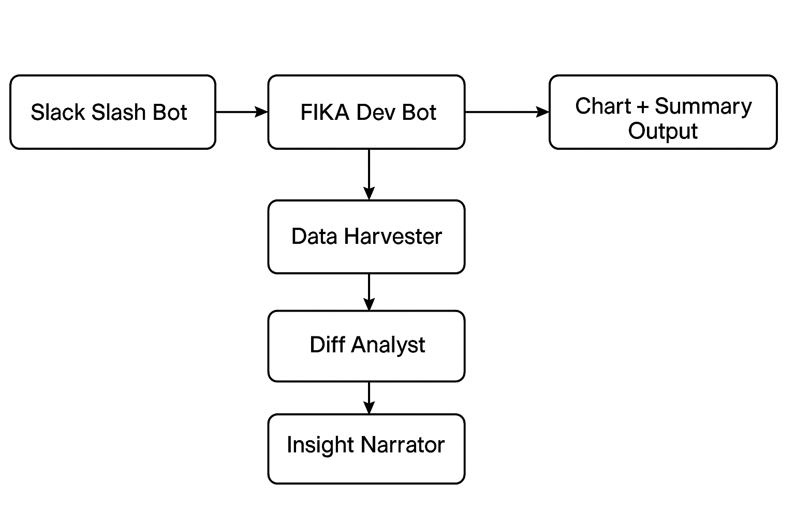

# 🧠 FIKA AI Engineering Insights Bot

A Slack-integrated, LangGraph-powered pipeline that provides automated engineering insights based on GitHub activity.



## 📹 Video Demo

👉 [Watch the demo here](https://drive.google.com/file/d/1VWef3G_EZ30ZhTcqRRyV5Wqf2VYVtwIx/view?usp=sharing) 

---

## ✨ Features

- ✅ GitHub commit harvesting (mocked for MVP)
- ✅ Commit churn and author-level analysis
- ✅ Top contributor detection
- ✅ High-churn commit warnings
- ✅ Automated weekly summary via `/dev-report`
- ✅ Charts: commits and code additions per contributor
- ✅ Prompt/response logging for traceability
- ✅ Spike detection and churn-defect risk flagging (MVP)
- 🚧 DORA metrics mapping (optional)
- 🚧 Pluggable LLM support (WIP)

---

## 🛠️ Tech Stack

- 🧠 LangGraph (LangChain Agents + StateGraph)
- 🐍 Python 3.9
- 🧪 Slack Bolt SDK (Socket Mode)
- 📊 Seaborn + Matplotlib
- 🗂️ GitHub API (mocked)
- 📝 JSON-based logging

---

## ⚙️ Setup

1. Clone the repo
   ```bash
   git clone https://github.com/Jaivatsal1582/fika-ai-engineering-insights-bot.git
   cd fika-ai-engineering-insights-bot
2. Install dependencies
   ```bash
   python3 -m venv .venv
   source .venv/bin/activate
   pip install -r requirements.txt
4. Create a .env file
   ```
    SLACK_BOT_TOKEN=xoxb-***
    SLACK_APP_TOKEN=xapp-***
    SLACK_SIGNING_SECRET=***
    OPENAI_API_KEY=sk-*** (if used)

5. Run the app
   ```bash
    make run

6. Use in Slack
    Type /dev-report in your Slack workspace to trigger the bot.

  Project Structure
```
├── agents/
│   ├── data_harvester.py
│   ├── diff_analyst.py
│   └── insight_narrator.py
├── generate_fake_chart.py
├── slack_app.py
├── state_graph.py
├── logs/
│   └── agent_logs.txt
├── output/
│   └── dev_chart.png
├── docs/
│   └── architecture.png
├── .env
├── Makefile
└── README.md
```
🙈 Security Note
Ensure you do not commit .env or any secrets. Use .gitignore and git filter-repo if needed.

📬 Contributing
Feel free to fork and submit PRs! Ideas for enhancements and better insight generation are welcome.


   
   
