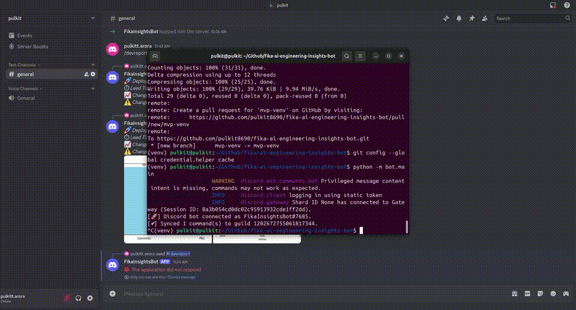

# 🛠️ Fika AI Engineering Insights Bot

**Pulkit Arora — July 2025**

---

## 🚀 Overview

This project implements a Discord bot delivering AI-powered, DORA-aligned engineering insights for the FIKA AI Research MVP challenge. It processes commit and PR data through a LangChain-inspired agent pipeline, generates actionable metrics, creates visualizations, and posts results directly to Discord with a simple slash command.

---

## ✨ Features

✅ **Agent Architecture**
- **DataHarvester**: fetches commit and PR data.
- **DiffAnalyst**: calculates metrics, churn, detects churn spikes.
- **InsightNarrator**: generates DORA-aligned AI insights.

✅ **Seed Script** with fake GitHub events for instant evaluation.

✅ **Discord Bot Slash Command** `/devreport`
- Posts AI-generated summaries.
- Attaches PNG charts (Commits vs PRs, Churn per Author).

✅ **One-command bootstrap**: `./run.sh`

---

## 🗂 Architecture Diagram

```
[Seed Script] → [SQLite DB]
      ↓              ↓
[DataHarvester] → [DiffAnalyst] → [InsightNarrator]
                                 ↓
                          [Discord Bot]
```

---

## 📦 Requirements

- Python 3.10+
- A Discord server with permissions to add bots

---

## 🚀 Quick Start

1️⃣ **Clone your fork:**
```bash
git clone https://github.com/YOUR_USERNAME/fika-ai-engineering-insights-bot.git
cd fika-ai-engineering-insights-bot
```

2️⃣ **Create a virtual environment and install requirements:**
```bash
python3.10 -m venv venv
source venv/bin/activate
pip install -r requirements.txt
```

3️⃣ **Add your environment variables in `.env`:**
```env
export DISCORD_BOT_TOKEN="your-bot-token-here"
export DISCORD_GUILD_ID="your-server-id-here"
```

4️⃣ **Load your environment:**
```bash
source .env
```

5️⃣ **Bootstrap the system:**
```bash
./run.sh
```

---

## 🤖 Discord Bot Setup

1. Visit the [Discord Developer Portal](https://discord.com/developers/applications).
2. Create a new application and add a Bot.
3. Copy your bot token.
4. Under **OAuth2 → URL Generator**:
   - Scopes: `bot`, `applications.commands`
   - Permissions: Send Messages, Use Slash Commands
5. Generate the OAuth2 invite URL and add the bot to your server.

---

## 📝 Slash Command Usage

Type `/devreport` in your Discord server:
- The bot will generate AI insights.
- The bot will post a narrative summary along with commit and churn charts.

---

## 🗂 Project Structure

```
.
├── agents/
│   ├── harvester.py
│   ├── analyst.py
│   └── narrator.py
├── bot/
│   └── main.py
├── reports/
│   └── plot.py
├── scripts/
│   └── seed_fake_data.py
├── pipeline.py
├── run.sh
├── README.md
└── demo.gif
```

---

## 📹 Demo

The animated demo GIF below demonstrates:
- Bot startup and connection to Discord.
- Typing `/devreport` in Discord.
- The bot’s narrative and charts response.



---

## 📜 License

This MVP code is provided as part of the FIKA AI Research challenge submission and is intended for evaluation only.

---
