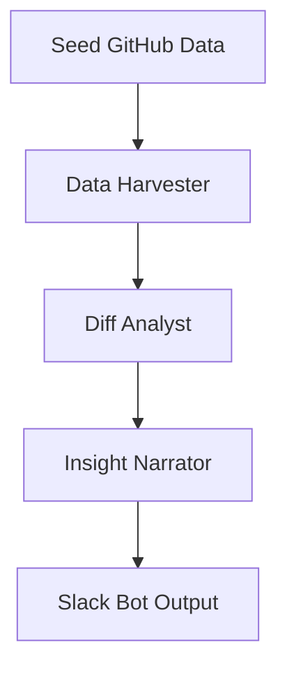

# FIKA AI Engineering Insights Bot

An AI-powered productivity bot that delivers engineering performance insights in Slack, built for the FIKA AI MVP Challenge.

## Features

* **LangGraph Agent Architecture**

  * `DataHarvester` → pulls GitHub commit/PR data
  * `DiffAnalyst` → analyzes churn & metrics
  * `InsightNarrator` → generates DORA-style summaries
* **Slack Integration**

  * Slash command: `/dev-report`
  * Posts weekly insights and churn charts
* **Metrics Tracked**

  * Commit count, PRs merged
  * Additions, deletions, files touched
  * Cycle time, review latency (simulated)


## Quickstart

### 1. Clone & Install

```bash
git clone https://github.com/YOUR_USERNAME/fika-productivity-bot.git
cd fika-productivity-bot
pip install -r requirements.txt
```

### 2. Add Environment Variables

Create a `.env` file:

```
SLACK_BOT_TOKEN=xoxb-...
SLACK_APP_TOKEN=xapp-...
```

### 3. Run the Bot

```bash
python bot/slack_bot.py
```

Then run `/dev-report` in Slack!

---

## LangGraph Architecture



---

##  Sample Output

> Posted in Slack via `/dev-report`

```
 Weekly Engineering Report — July 08, 2025
•  Deployment Frequency: 1 PRs merged during the period.
•  Average lead time: 73.0 hours from PR creation to merge.
•  No high-risk churn spikes detected.
•  vivek made 1 commits (+50 / -20 lines, 3 files changed)
```

*(plus a chart attachment)*

---

## Dev Notes

* This MVP uses fake GitHub data in `data/seed_github.json`
* You can replace with real GitHub webhook ingestion if needed
* All agents log input/output for auditability

---

## Tech Stack

* Python 3.10+
* LangChain & LangGraph
* Slack Bolt SDK
* Matplotlib
* DuckDB (or any light storage)

---

## Submission

* PR to challenge repo 
* README 
* Demo: \[https://www.loom.com/share/b835364a89bc43619b1877b4b437c44a?sid=e1013e96-1cb8-43ad-ac6d-1d1f3418c91a]
